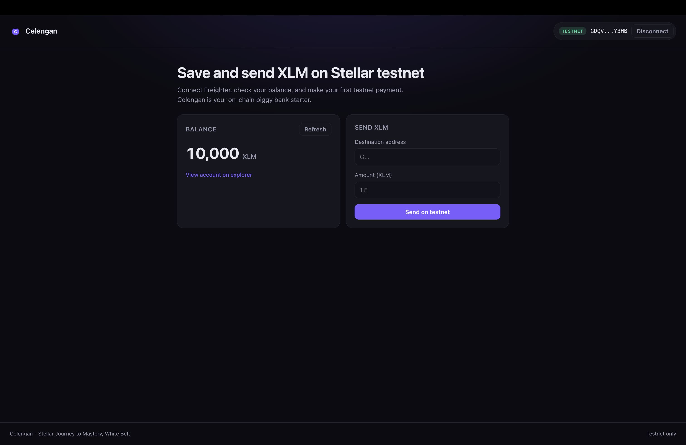
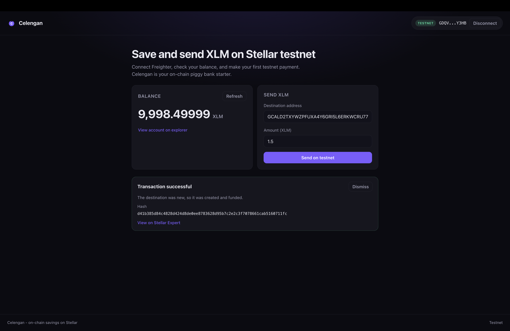

# Celengan

Celengan (Indonesian for piggy bank) is a Stellar dApp for checking your balance
and sending XLM on the Stellar testnet. Connect the Freighter wallet, view your
XLM balance, fund a fresh account with one click, and send a payment with live
transaction feedback.

## Features

- Connect and disconnect the Freighter wallet
- Detect the active network and require Stellar Testnet
- Fetch and display the connected wallet's XLM balance
- Fund an empty testnet account with one click (friendbot)
- Send an XLM payment on testnet (auto-creates the destination if it is new)
- Transaction feedback: pending, success (with hash and explorer link), or a
  readable failure message

## Tech stack

- React 19 + Vite + TypeScript
- `@stellar/stellar-sdk` (Horizon, transaction building and submission)
- `@stellar/freighter-api` (wallet connection and signing)
- Plain CSS (no UI framework)

## Project structure

```
celengan-stellar/
  web/    # React + Vite frontend
  docs/   # screenshots
```

## Prerequisites

- Node.js 20+ and npm
- The [Freighter](https://www.freighter.app/) browser extension, set to the
  **Testnet** network

## Run locally

```
cd web
npm install
npm run dev
```

Open the printed local URL (default http://localhost:5173).

Build for production:

```
cd web
npm run build
npm run preview
```

## Usage

1. Set Freighter to the Testnet network.
2. Click **Connect Freighter** and approve access.
3. If the balance is 0, click **Get testnet XLM** to fund via friendbot.
4. Enter a destination address and an amount, then **Send on testnet**.
5. On success, open the transaction on Stellar Expert via the provided link.

## Screenshots

Connected wallet and balance:



Successful testnet transaction (added after running a send):



## License

MIT
