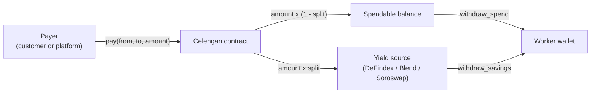
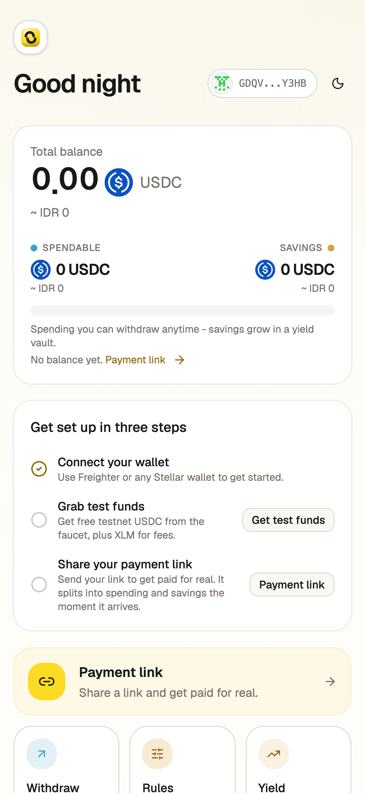
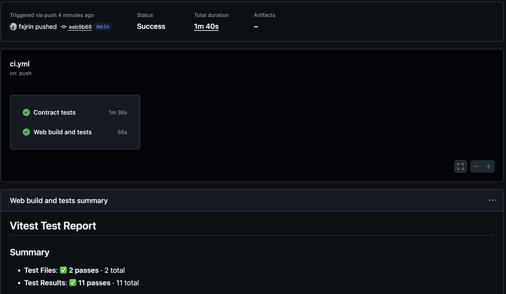
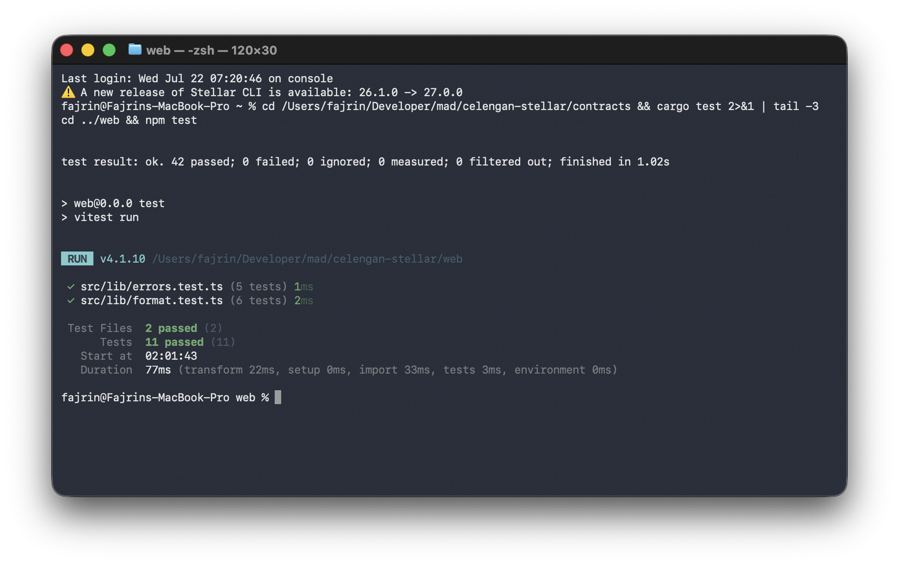

# Celengan

Celengan (Indonesian for piggy bank) turns every incoming payment into automatic
savings on Stellar. A payer sends USDC through the Celengan smart contract; the
contract splits it between a spendable balance and a yield-earning savings
position, with optional time locks for goals and emergency funds. Saving becomes
the default instead of an afterthought.

**Live demo:** https://celengan-stellar.vercel.app

## How it works



Each account chooses its own split (default 20%), yield target, and an optional
time lock on savings. The contract holds spendable balances and routes the
savings share into one of three real testnet protocols via inter-contract calls:

| Yield target | Protocol | Mechanism |
|---|---|---|
| DeFindex (default) | DeFindex USDC vault | vault shares |
| Blend | Blend USDC pool | non-collateral supply |
| Soroswap | Soroswap USDC/XLM pair | LP position |

## Features

- Payment splitting with a per-account configurable savings ratio
- Three switchable on-chain yield sources (DeFindex vault, Blend pool, Soroswap LP)
- Savings time lock for goals and emergency funds (with extension rules)
- Payment links and QR codes to request payment to your address
- Live activity feed streamed from on-chain contract events
- Owner pause switch (deposits pause, withdrawals always work)
- Multi-wallet connect (Freighter, xBull, Albedo, Lobstr, Rabet and more)
- Multi-language UI (English, Indonesian, Vietnamese) with local currency display
- Mobile responsive, with loading and error states throughout

## Contracts (testnet)

| Contract | Address |
|---|---|
| celengan | `CAFTAGQPSJIO5VSDFL6LS5NL4UDS7OQ2D22US4QTVHJJW6Y7YLWCPZ33` |
| USDC (Blend testnet asset) | `CAQCFVLOBK5GIULPNZRGATJJMIZL5BSP7X5YJVMGCPTUEPFM4AVSRCJU` |
| DeFindex vault | `CBMVK2JK6NTOT2O4HNQAIQFJY232BHKGLIMXDVQVHIIZKDACXDFZDWHN` |
| Blend pool | `CCEBVDYM32YNYCVNRXQKDFFPISJJCV557CDZEIRBEE4NCV4KHPQ44HGF` |
| Soroswap router | `CCJUD55AG6W5HAI5LRVNKAE5WDP5XGZBUDS5WNTIVDU7O264UZZE7BRD` |
| Soroswap USDC/XLM pair | `CBR76WMT6J733CCVBP23M2EL5QGP5HXLPEFNFZGZ7IB6QHOJAHP7YM3V` |

- Contract on explorer: https://stellar.expert/explorer/testnet/contract/CAFTAGQPSJIO5VSDFL6LS5NL4UDS7OQ2D22US4QTVHJJW6Y7YLWCPZ33
- Deploy transaction: https://stellar.expert/explorer/testnet/tx/1dea53cc82463b69f2fae6ebdee8c220d37ba748e4e7c16136ae102f69197fc8
- Example interaction (`withdraw_spend`): https://stellar.expert/explorer/testnet/tx/ed58c0a8d76c6d6886b544acf6a90661812352e98e3c523b2842a7d372f6403f
- Example inter-contract interaction (`withdraw_savings` redeeming DeFindex vault shares): https://stellar.expert/explorer/testnet/tx/356161f0d213d6760a1382d045377c544eed5873427d56d92299aaa351078a19

## Contract API

| Function | Description |
|---|---|
| `pay(from, to, amount)` | pay `to` through the splitter; savings share goes to `to`'s yield source |
| `withdraw_spend(user, amount)` | withdraw from the spendable balance |
| `withdraw_savings(user, shares)` | redeem savings shares from the active yield source |
| `set_split(user, bps)` | set the savings ratio in basis points |
| `set_lock(user, until)` | time-lock savings until a unix timestamp |
| `set_yield_target(user, target)` | switch yield source (only while savings are empty) |
| `account_of(user)` | read split, balances, lock and yield target |
| `pause()` / `unpause()` | owner-only circuit breaker for deposits |

## Repository structure

```
celengan-stellar/
  contracts/            # Soroban celengan contract (Rust, 42 unit tests)
  packages/celengan/    # generated TypeScript bindings (committed dist/)
  web/                  # React 19 + Vite + Tailwind v4 frontend (vitest tests)
  scripts/              # deploy.sh and e2e.sh testnet workflows
  docs/                 # screenshots and notes
  .github/workflows/    # CI: cargo test + web test/build
  deployments.json      # deployed contract addresses per network
```

## Prerequisites

- Node.js 20+ and npm
- Rust and the [Stellar CLI](https://developers.stellar.org/docs/tools/cli)
- A Stellar wallet extension set to the Testnet network

## Run locally

Contract tests:

```
cd contracts
cargo test
```

Frontend (installs the linked bindings package automatically via postinstall):

```
cd web
npm install
npm run dev
```

Frontend unit tests:

```
cd web
npm test
```

## Deployment workflow

Deploy the contract (build + deploy with constructor wiring to the yield
protocols):

```
./scripts/deploy.sh <deployer-identity> <owner-g-address>
```

Then update the contract id in `deployments.json` and
`web/src/lib/config.ts` (or set `VITE_CELENGAN_ID`), and regenerate bindings:

```
stellar contract bindings typescript \
  --network testnet --contract-id <id> \
  --output-dir packages/celengan --overwrite
```

End-to-end check on testnet (faucet, pay, split, vault deposit, withdrawals):

```
./scripts/e2e.sh <contract-id>
```

The web app auto-deploys to Vercel on push to `main` (root directory `web`).

## Testing and CI

- `contracts/`: 42 Rust unit tests covering the split math, yield-target
  routing, locks, pause behavior and error paths
- `web/`: vitest unit tests for amount parsing/formatting and contract error
  mapping
- GitHub Actions runs both suites plus the production build on every push and
  pull request ([ci.yml](.github/workflows/ci.yml))

## Screenshots

Mobile responsive UI:



CI pipeline running:



Test output (contracts and web):



## Demo video

Watch the 1-2 minute demo: (link to be added)

## License

MIT
