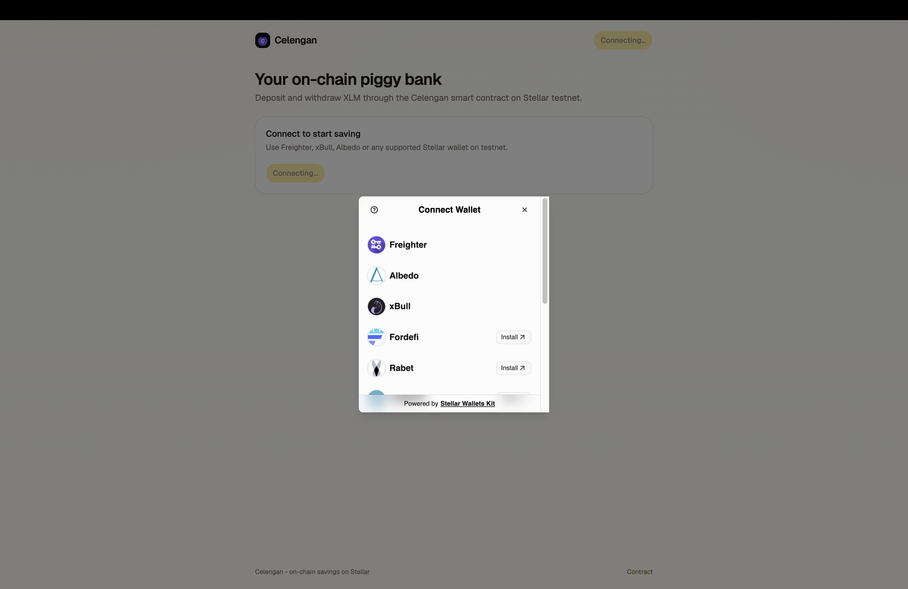
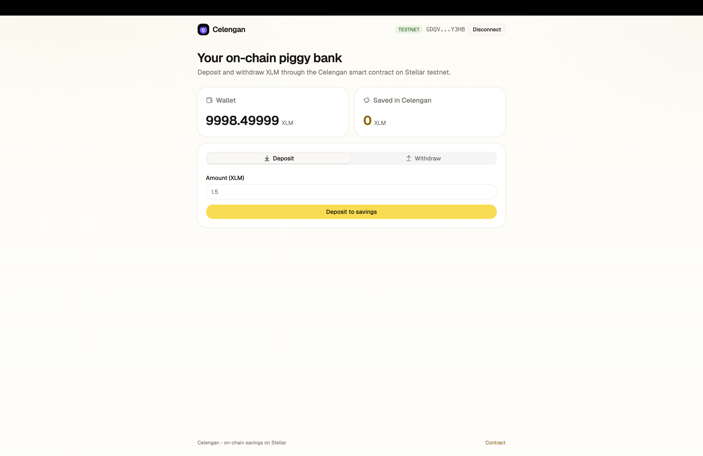
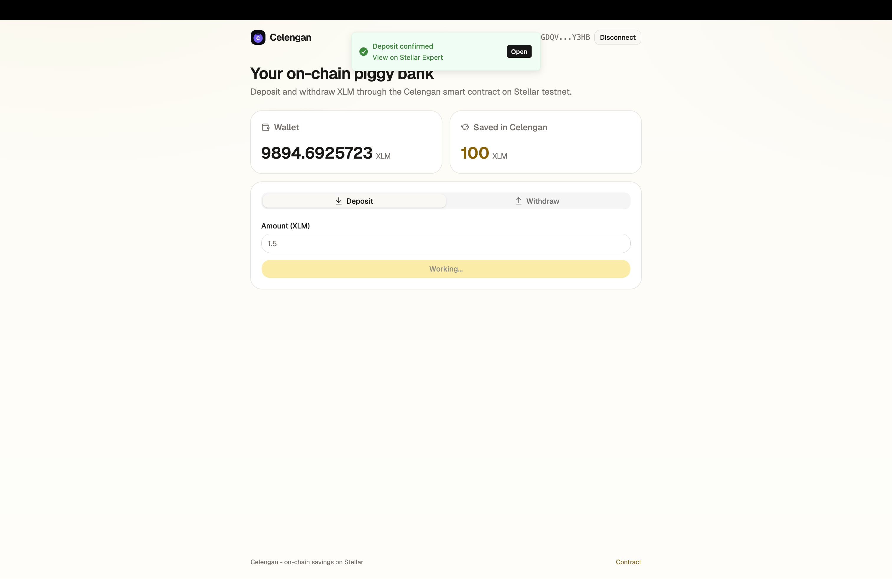

# Celengan

Celengan (Indonesian for piggy bank) is a Stellar dApp: an on-chain savings
vault. Connect any Stellar wallet, deposit XLM into the Celengan smart contract
on the Stellar testnet, and withdraw anytime. Balances are held on-chain by the
contract.

## Features

- Multi-wallet connect via Stellar Wallets Kit (Freighter, xBull, Albedo, Lobstr,
  Rabet and more)
- Deposit and withdraw XLM through the `celengan` Soroban contract
- On-chain savings balance read from the contract; wallet XLM balance from Horizon
- One-click testnet funding (friendbot)
- Transaction status feedback with hash and explorer link
- Handled error cases: no wallet connected, request rejected, insufficient balance

## Tech stack

- Contract: Soroban (Rust), `soroban-sdk` 26
- Frontend: React 19 + Vite + TypeScript + Tailwind v4
- Wallet: `@creit.tech/stellar-wallets-kit`
- Chain access: `@stellar/stellar-sdk` (Horizon + Soroban RPC) and generated
  TypeScript contract bindings

## Contract (testnet)

- `celengan`: `CD265PMPW2K2RKGW2XXZBZAUB7R5JNJKKDAZ7YK4TG7GVW6FQBB63NYF`
- Explorer: https://stellar.expert/explorer/testnet/contract/CD265PMPW2K2RKGW2XXZBZAUB7R5JNJKKDAZ7YK4TG7GVW6FQBB63NYF

## Repository structure

```
celengan-stellar/
  contracts/                 # Soroban celengan contract (Rust)
  packages/celengan-client/  # generated TypeScript bindings
  web/                       # React + Vite frontend
  docs/                      # screenshots
```

## Prerequisites

- Node.js 20+ and npm
- Rust and the [Stellar CLI](https://developers.stellar.org/docs/tools/cli) (for
  the contract)
- A Stellar wallet extension set to the Testnet network

## Run locally

Contract tests and build:

```
cd contracts
cargo test
stellar contract build
```

Frontend:

```
cd web
npm install
npm run dev
```

Open the printed local URL (default http://localhost:5173).

## Deploy the contract (testnet)

```
cd contracts
stellar contract build
stellar contract deploy \
  --wasm target/wasm32v1-none/release/celengan.wasm \
  --source <your-identity> \
  --network testnet \
  -- \
  --token CDLZFC3SYJYDZT7K67VZ75HPJVIEUVNIXF47ZG2FB2RMQQVU2HHGCYSC
```

The `--token` argument is the testnet native XLM Stellar Asset Contract. Set
`VITE_CELENGAN_ID` (or update `web/src/lib/config.ts` and `deployments.json`) to
the newly deployed contract id.

## Usage

1. Connect a Stellar wallet on testnet.
2. If the wallet balance is 0, click Get testnet XLM to fund via friendbot.
3. Deposit XLM into the contract, or withdraw from your savings.
4. Each contract call shows a status and a link to the transaction on Stellar Expert.

## Screenshots

Captured on testnet.

Wallet options (multi-wallet connect):



Deposit and withdraw dashboard:



Successful contract-call transaction:



## License

MIT
